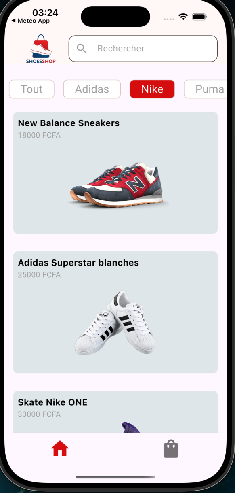
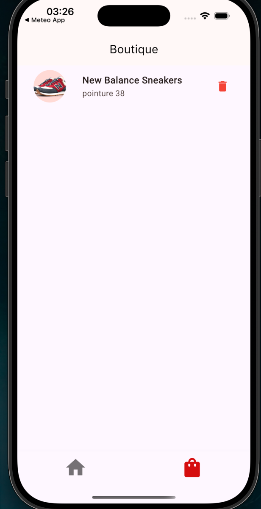
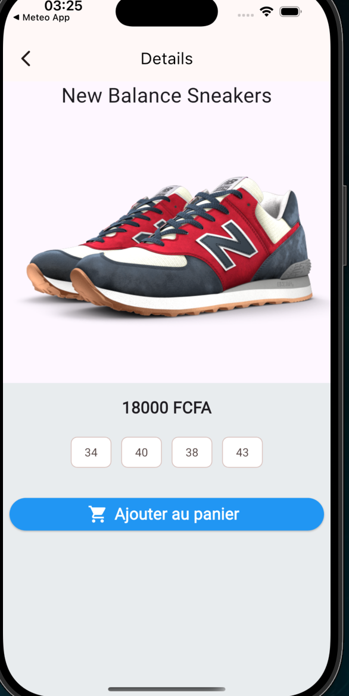

# shop_app

Une application mobile avec **Flutter** qui affichent juste des produits avec 2 pages (accueil et le panier)  développée dans le cadre de ma formation .

## 🛠️ Technologies utilisées
- **Framework :** Flutter
- **Langage :** Dart
- **Gestion d'état :** [Bloc / Cubit]
- **Outils :** [Supabase,Get it ]

## 📸 Aperçu

